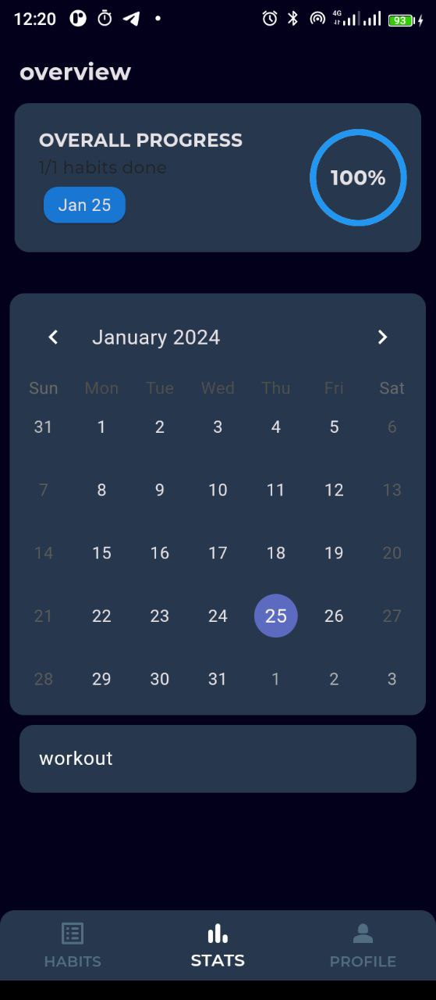
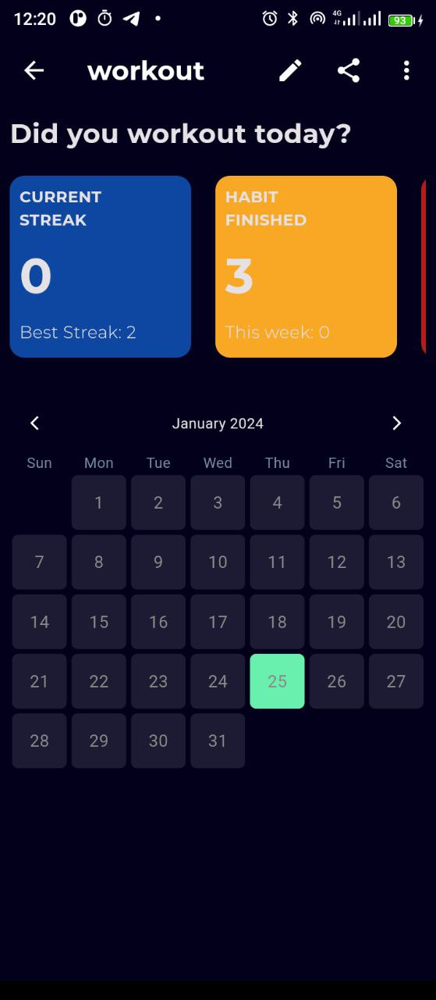

# HABIT TRACKER APP

A simple, not so simple habit tracker app made with Flutter.

## Table of Contents

- [Screenshots](#screenshots)
- [Built with](#built-with)
- [Features](#features)
- [Useful Resources](#useful-resources)
- [Installation and Usage Instructions](#installation-and-usage-instructions)
- [Author](#author)
- [Feedback](#feedback)

## Screenshots

|  |  |  |

|  |  |

## Built with

- Flutter
- Dart
- Riverpod state management
- Hive (local storage)

## Features

1. **Cross-Platform Compatibility:**

   - Works seamlessly on both Android and iOS platforms.

2. **User-Friendly Interface:**

   - Intuitive design for easy navigation and task management.

3. **Task Management:**

   - Create, read, update, and delete (CRUD) habits.

4. **Search:**

   - Search for specific habits.

5. **Offline Usage:**

   - Access and manage habits without an internet connection.

6. **Profile Page:**

   - Select from custom avatars or choose from the gallery.

7. **Track Progress:**
   - View custom charts, calendars, and heatmaps to track progress.

## Useful Resources

- [Riverpod Documentation](https://riverpod.dev/docs/introduction/getting_started)
- [Learn Riverpod Video](https://youtu.be/pwflXIA-6YQ?si=HtgskXpuicavAFqS)
- [Hive Documentation](https://docs.hivedb.dev/#/)
- [Hive Video Tutorial](https://youtu.be/xN_OTO5EYKY?si=8RkZw7Wpl0udNmNH)

## Installation and Usage Instructions

1. Clone the repository.
2. Install dependencies using `flutter pub get`.
3. Run the app on your preferred emulator or physical device.

## Author

- Github - [JER3MIAH](https://github.com/)
- Twitter - [@jeremiah_008](https://twitter.com/jeremiah_008)

## Feedback

Feel free to reach out to me via email at [jeremiah.devv@gmail.com](mailto:jeremiah.devv@gmail.com) for any feedback or queries.
